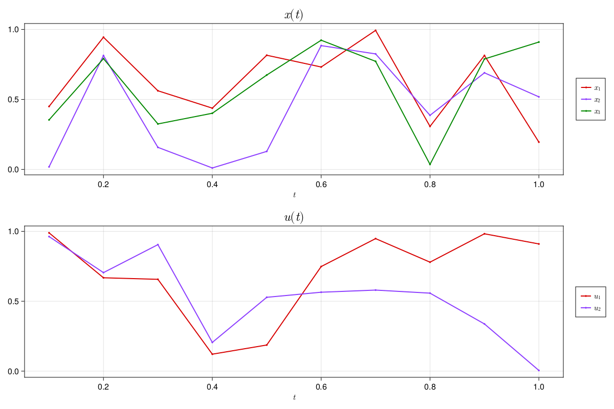

# NamedTrajectories.jl

<div align="center"> <a href="https://github.com/aarontrowbridge/Piccolo.jl">
    
</a> </div>

<div align="center">

| **Documentation** | **Build Status** | **Support** |
|:-----------------:|:----------------:| :----------:|
| [](https://aarontrowbridge.github.io/NamedTrajectories.jl/stable/) [](https://aarontrowbridge.github.io/NamedTrajectories.jl/dev/) | [](https://github.com/aarontrowbridge/NamedTrajectories.jl/actions/workflows/CI.yml?query=branch%3Amain) [](https://codecov.io/gh/aarontrowbridge/NamedTrajectories.jl)| [](https://unitary.fund)

</div>

**NamedTrajectories.jl** is a package for working with trajectories of named variables. It is designed to be used with [QuantumCollocation.jl](https://github.com/aarontrowbridge/QuantumCollocation.jl) and [Piccolo.jl](https://github.com/aarontrowbridge/Piccolo.jl).

Please see the `dev` [documentation](https://aarontrowbridge.github.io/NamedTrajectories.jl/dev/) for more information.

## Installation

NamedTrajectories.jl is now registered! Install in the REPL by entering pkg mode with `]` and then running 

```julia
pkg> add NamedTrajectories
```

or to install the latest master branch run

```julia
pkg> add NamedTrajectories#main
```


## Basic Usage

Users can define `NamedTrajectory` types which have lots of useful functionality. For example, you can access the data by name or index.  In the case of an index, a `KnotPoint` is returned which contains the data for that timestep.

```julia
using NamedTrajectories

# define number of timesteps and timestep
T = 10
dt = 0.1

# build named tuple of components and data matrices
components = (
    x = rand(3, T),
    u = rand(2, T),
)

# build trajectory
traj = NamedTrajectory(components; timestep=dt, controls=:u)

# access data by name
traj.x # returns 3x10 matrix of x data
traj.u # returns 2x10 matrix of u data

z1 = traj[1] # returns KnotPoint with x and u data

z1.x # returns 3 element vector of x data at timestep 1
z1.u # returns 2 element vector of u data at timestep 1

traj.data # returns data as 5x10 matrix
traj.names # returns names as tuple (:x, :u)

# simple build in plotting
plot(traj)
```

This script generates the following plot as demonstrated in [demo.ipynb](examples/demo.ipynb)



## TODO

- [ ] Add contributing guidelines for
  - [ ] documentation
  - [ ] new features
  - [ ] testing
  - [ ] examples
- [ ] Flesh out manual in documentation, see [docs/literate/man](docs/literate/man) or [docs/literate/manual.jl](docs/literate/manual.jl)
- [ ] Convert literate files to notebooks for examples
- [ ] Internal optimizations
  - [ ] Handling of data as views
  - [ ] KnotPoint as view
  - [ ] More efficient copying and constructing
- [ ] Docstrings for all functions
- [ ] functionality
  - [ ] random NTs
